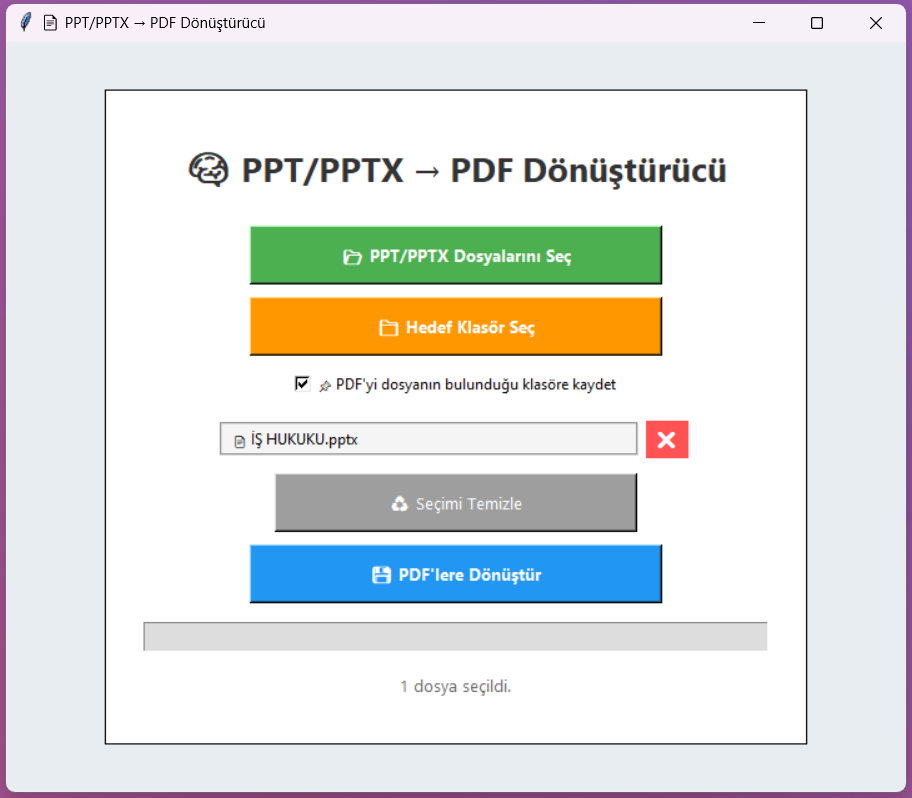
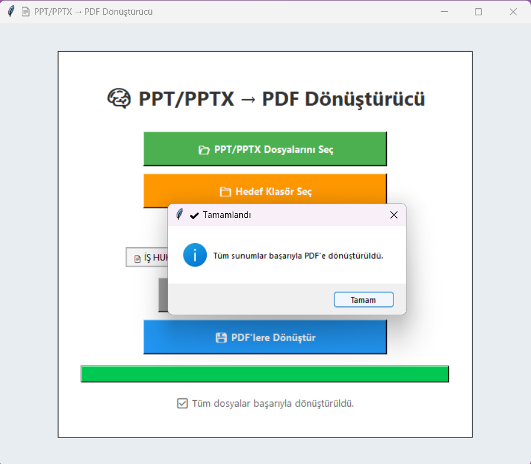

# pptx-to-pdf-converter
Bu proje özellikle sınav haftalarında sunumları pdf'e dönüştürüp çıktı almak/pdf üzerinden çalışmak için hocaların sisteme yüklediği sunumları internet üzerinden uzun zamanda ve sayı kısıtı ile dönüştürme çabam sonucu işleri biraz daha kolaylaştırmak adına yapılmıştır.

## Gerekli Kütüphaneleri Yüklemek İçin :
> Öncelikle localde yer alan dosya konumunuzu(CMD,PS veya VsCode Terminal) açmanız gerekmektedir!

```bash
pip install -r requirements.txt
```

## Kurulumdan Sonra Uygulamayı Başlatmak İçin : 

```bash
python pptxtopdf.py
```

## 🖼️ Uygulama Görselleri

<p float="left" align="center">
  
  
  
</p>
